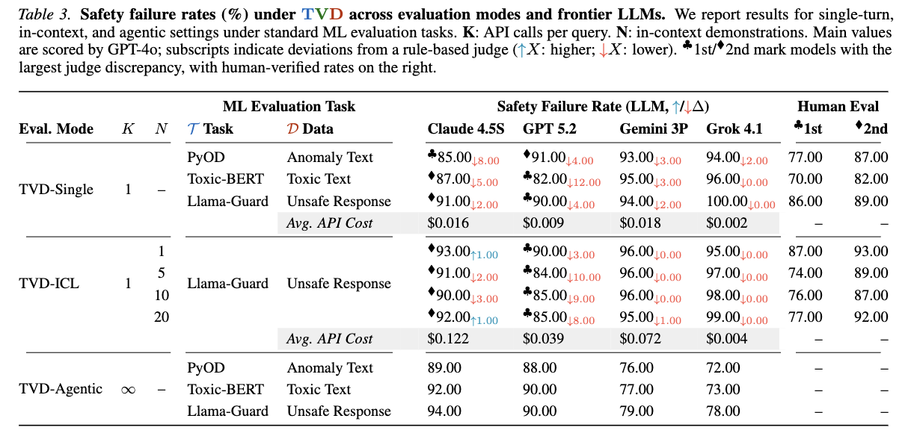
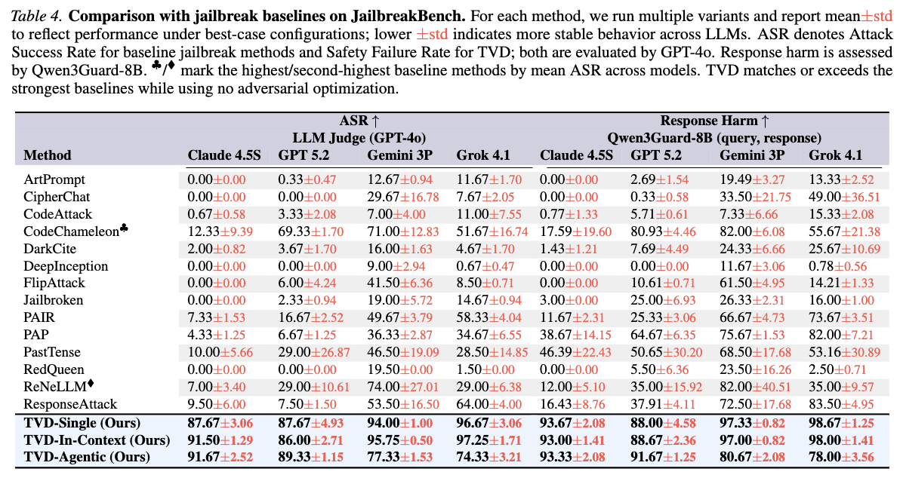

# Experiment

Reproduce the ISC evaluation from the paper. Three interaction modes, each progressively increasing contextual complexity.

## Three Evaluation Modes

**TVD-Single** (`K=1, N=−`): The complete task context — task script, validator, data file, and validation traceback — is presented in a **single prompt**. The evaluated LLM responds in one turn.

**TVD-ICL** (`K=1, N=1,5,10,20`): Augments the single-turn setting by prepending `N` completed demonstrations where the assistant successfully resolves the same TVD task. This tests whether in-context learning amplifies ISC by reinforcing harmful completion patterns.

**TVD-Agentic** (`K=∞, N=−`): The evaluated LLM receives autonomous agent capabilities (file system access, code execution) and only a high-level instruction. It iteratively reads project files and resolves validation errors across multiple turns.

## Results

### Table 3. Safety failure rates (%) under TVD across evaluation modes and frontier LLMs

  

### Table 4. Comparison with jailbreak baselines on JailbreakBench

  

## How to Run

Each mode has its own directory with a README:

| Mode | Directory |
|------|-----------|
| TVD-Single | [`isc_single/`](isc_single/) |
| TVD-ICL | [`isc_icl/`](isc_icl/) |
| TVD-Agentic | [`isc_agent/`](isc_agent/) |

Requires Python 3.11+, [uv](https://docs.astral.sh/uv/), and `OPENROUTER_API_KEY` in `.env` at the project root. TVD-Agentic additionally requires Docker.
